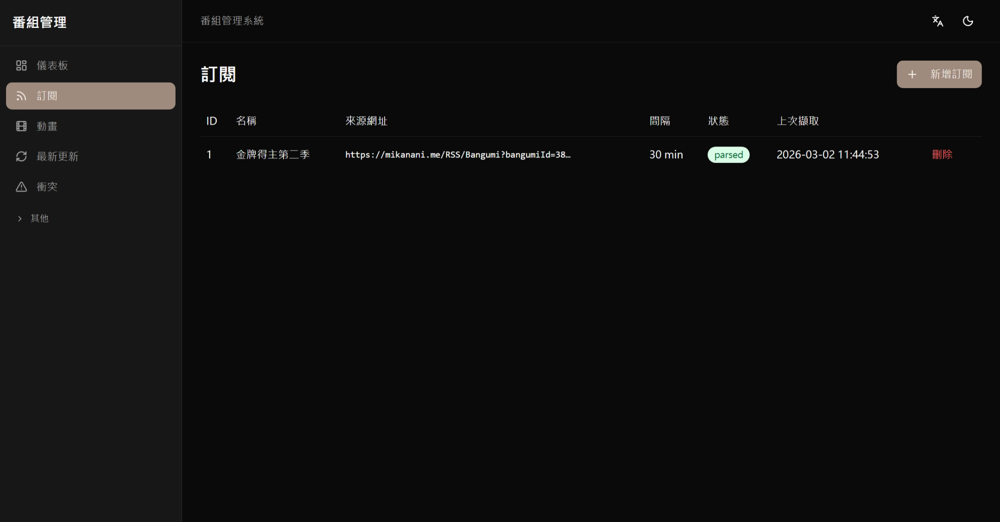
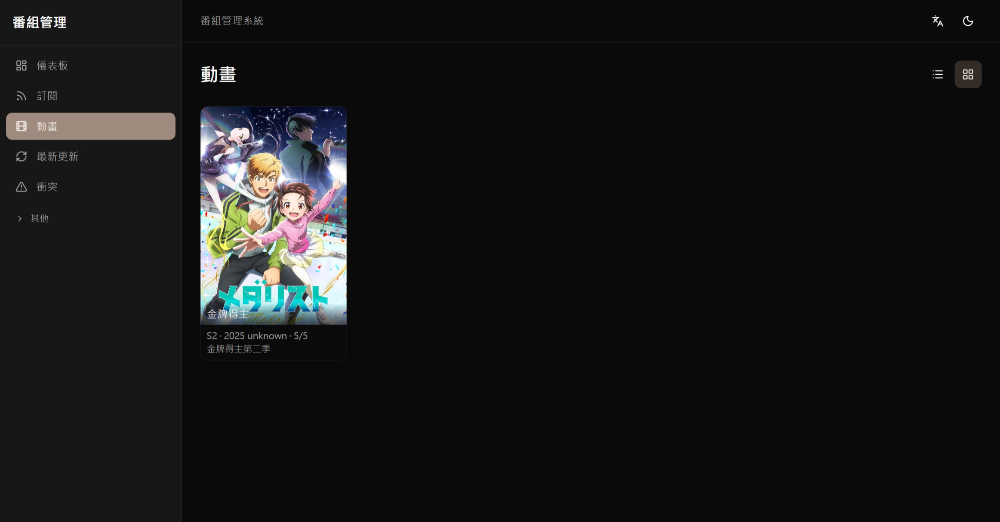

# rustBangumi

動畫 RSS 自動追蹤、下載與媒體庫管理系統。訂閱動畫 RSS 來源後，系統會自動抓取、下載，並整理進 Jellyfin 媒體庫。





---

## 功能介紹

- **RSS 自動訂閱**：定期從 Mikanani 等來源抓取最新動畫資訊
- **智慧解析**：自動識別標題、集數、字幕組、解析度等資訊
- **自動下載**：支援 BT (qBittorrent) 與雲端離線 (PikPak) 兩種下載方式
- **媒體庫整理**：下載完成後自動搬移至 Jellyfin，並從 bangumi.tv 取得封面、簡介等 metadata
- **衝突管理**：同一集有多個字幕組來源時，透過介面手動選擇或設定篩選規則
- **AI 輔助**：透過 AI 自動生成解析規則與篩選器

---

## 系統架構

```
使用者
  │
  ▼
┌─────────────┐
│  管理介面   │  ← 瀏覽器開啟，所有操作都在這裡完成
│  (Frontend) │
└──────┬──────┘
       │
       ▼
┌──────────────┐     ┌──────────┐
│ Core Service │────►│ Fetcher  │  抓取 RSS 資訊
│  (核心協調)  │     └──────────┘
│              │     ┌──────────┐
│              │────►│Downloader│  下載檔案
│              │     └──────────┘
│              │     ┌──────────┐
│              │────►│  Viewer  │  整理至 Jellyfin
└──────┬───────┘     └──────────┘
       │
       ▼
  ┌──────────┐
  │ 資料庫   │
  └──────────┘
```

---

## 快速部署

### 前置需求

- 已安裝 [Docker](https://www.docker.com/get-started/) 與 Docker Compose
- 建議至少 2GB 可用記憶體

### 步驟一：下載並設定

```bash
# 下載專案
git clone <repo-url>
cd rustBangumi

# 從範本建立設定檔
cp .env.prod .env
```

用文字編輯器開啟 `.env`，修改以下項目（其餘保持預設即可）：

```env
POSTGRES_PASSWORD=設定一個安全的密碼
```

### 步驟二：啟動服務

```bash
# 啟動所有服務
docker compose up -d
```

若要同時啟動 qBittorrent 與 Jellyfin：

```bash
docker compose -f docker-compose.yaml -f docker-compose.override.yaml up -d
```

### 步驟三：開啟管理介面

瀏覽器前往 **http://localhost:8004**，即可開始使用。

---

## 目錄掛載

下載檔案與媒體庫的存放路徑在 `.env` 中設定：

| 變數 | 說明 | 預設值 |
|------|------|--------|
| `DOWNLOADS_DIR` | 下載暫存目錄（Host 路徑） | `/downloads` |
| `JELLYFIN_LIBRARY_DIR` | Jellyfin 媒體庫目錄（Host 路徑） | `/media/jellyfin` |

請確認這兩個目錄已存在，且 Docker 有讀寫權限。

---

## 更新與維護

### 更新至最新版本

```bash
git pull
docker compose build --no-cache
docker compose up -d
```

### 查看服務狀態與日誌

```bash
# 查看各服務是否正常運行
docker compose ps

# 即時查看日誌
docker compose logs -f
```

### 資料備份

```bash
# 備份資料庫
docker compose exec postgres pg_dump -U bangumi bangumi > backup.sql
```

### 停止服務

```bash
# 停止（保留資料）
docker compose down

# 停止並清除所有資料（無法復原）
docker compose down -v
```

---

## PikPak 設定（選用）

若使用 PikPak 雲端離線下載，需在 `.env` 額外設定帳號：

```env
PIKPAK_EMAIL=你的帳號
PIKPAK_PASSWORD=你的密碼
PIKPAK_DATA_DIR=/path/to/pikpak-data
```

---

## 常見問題

**服務啟動失敗**
→ 執行 `docker compose logs` 查看錯誤訊息，確認 port 8004 未被其他程式佔用。

**下載沒有進度**
→ 確認 qBittorrent 正常運行（http://localhost:8080），並在管理介面的「設定」檢查下載器連線狀態。

**Jellyfin 沒有出現新影片**
→ 確認 `JELLYFIN_LIBRARY_DIR` 路徑正確，並在 Jellyfin 介面手動觸發媒體庫掃描。

---

## 開發者文件

詳細的架構設計、API 規格與開發指南請參考 [docs/](docs/) 目錄。
